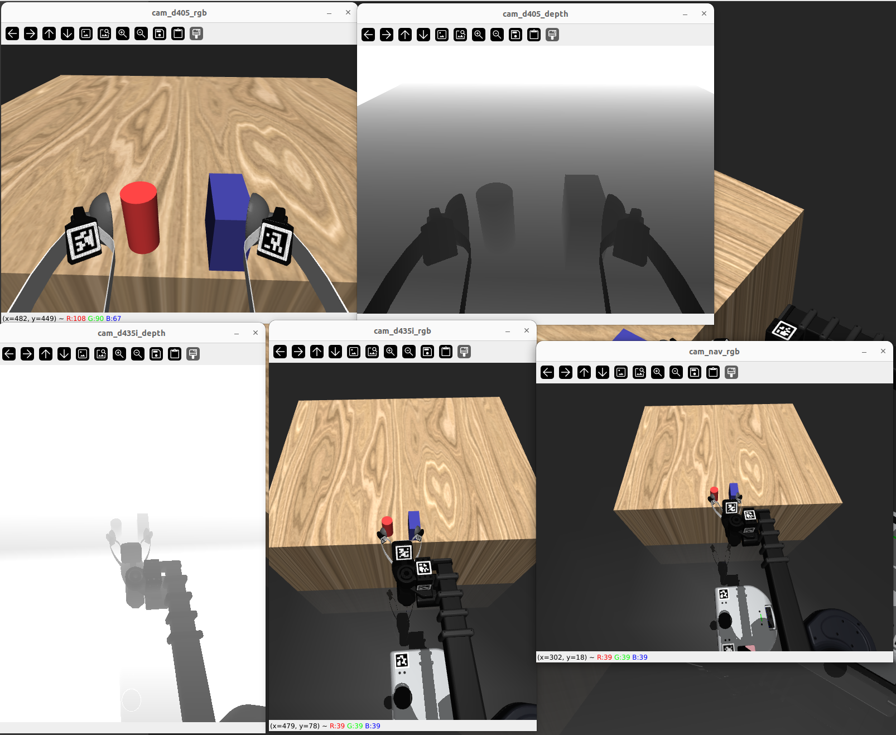
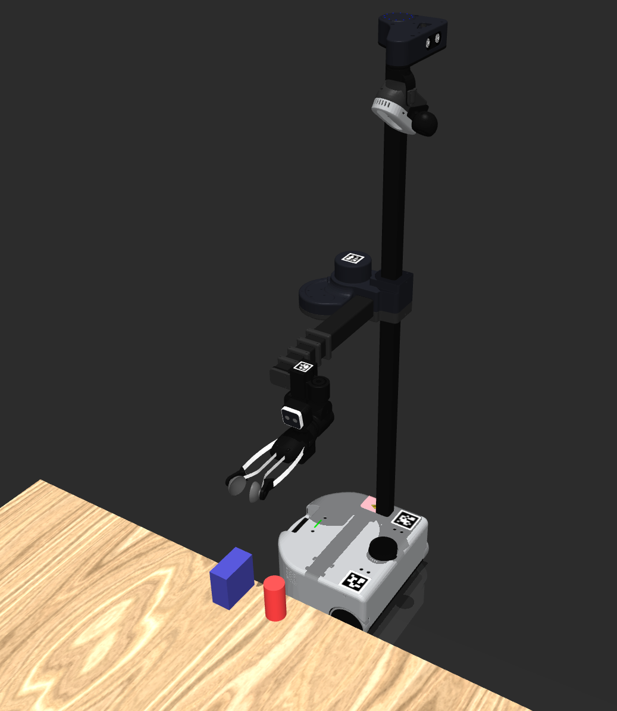
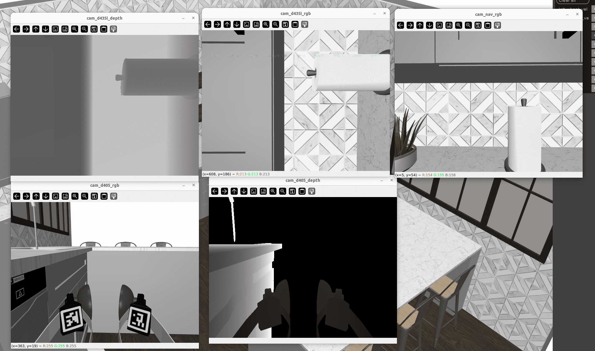

# Stretch Mujoco

[](https://www.python.org/downloads/release/python-31012/)
[](https://github.com/pre-commit/pre-commit)
[](https://github.com/psf/black)


Stretch in Kitchen scenes from [Robocasa](https://github.com/robocasa/robocasa)

This library provides the simulation stack for Stretch with [Mujoco](https://github.com/google-deepmind/mujoco).
Currently only Stretch 3 version is fully supported with position control interface for all robot joints and velocity control for base. Camera data with depth perception and camera parameters are provided. The library supports simuation with GUI and also headless mode. Stretch can be spawned in any Robocasa provided kitchen environments.

## Getting Started

Install Mujoco (v3.0>), older versions might work but not tested.

```
git clone https://github.com/hello-robot/stretch_mujoco
cd stretch_mujoco
pip install -e .
```

Note: For conda environments `conda install mujoco` is recommended.

Spawn Stretch in default scene and see the camera frames

```
python3 -m stretch_mujoco.stretch_mujoco
```

<p>
    
    
</p>

#### Install [Robocasa](https://github.com/robocasa/robocasa)

```
git clone https://github.com/ARISE-Initiative/robosuite -b robocasa_v0.1
cd robosuite
pip install -e .
cd ../
git clone https://github.com/robocasa/robocasa
cd robocasa
pip install -e .
conda install -c numba numba -y
python robocasa/scripts/download_kitchen_assets.py  
python robocasa/scripts/setup_macros.py   
```

## Try Examples Scripts

[Keyboard teleop](https://github.com/hello-robot/stretch_mujoco/blob/main/examples/keyboard_teleop.py)

```
cd examples/
python3 -m keyboard_teleop.py
```

[Gamepad teleop](https://github.com/hello-robot/stretch_mujoco/blob/main/examples/gamepad_teleop.py)

Control Stretch in simulation using any xbox type gamepad (uses xinput)

```
cd examples/
python3 stretch_mujoco_gamepad.py
```

[Robocasa environments](https://github.com/hello-robot/stretch_mujoco/blob/main/stretch_mujoco/robocasa_gen.py#L73)

Spawn Stretch in any robocasa kitchen scenes using the [robocasa_gen.model_generation_wizard](https://github.com/hello-robot/stretch_mujoco/blob/main/stretch_mujoco/robocasa_gen.py#L73) API.




## Try Writing Code

Use the [StretchMujocoSimulator](https://github.com/hello-robot/stretch_mujoco/blob/main/stretch_mujoco.py) class implementation which provides the control interface for starting the Simulation, position control the robot, read joint status and read all the camera streams. You can try the below lines simply from Ipython terminal. The class also has `mjModel` and `mjData` elements which Advanced users take advantage with [official Mujoco documentation](https://mujoco.readthedocs.io/en/stable/python.html).

```python
from stretch_mujoco import StretchMujocoSimulator

robot_sim = StretchMujocoSimulator('./scene.xml')
robot_sim.start() # This will start the simulation and open Mujoco-Viewer window

# Poses
robot_sim.home()
robot_sim.stow()

# Position Control 
robot_sim.move_to('lift',0.6)
robot_sim.move_by('head_pan',0.1)

# Base Velocity control
robot_sim.set_base_velocity(0.3,-0.1)

# Get Joint Status (updated continuously in simulation callback mjcb_control)
print(robot_sim.status)
"""
Output:
{'time': 6.421999999999515,
 'base': {'x_vel': -3.293721562016785e-07,'theta_vel': -3.061556698064456e-05},
 'lift': {'pos': 0.5889703729548038, 'vel': 1.3548342274419937e-08},
 'arm': {'pos': 0.09806380391427844, 'vel': -0.0001650879063921366},
 'head_pan': {'pos': -4.968686850480367e-06, 'vel': 3.987855066304579e-08},
 'head_tilt': {'pos': -0.00451929555883404, 'vel': -2.2404905787897265e-09},
 'wrist_yaw': {'pos': 0.004738908190630005, 'vel': -5.8446467640096307e-05},
 'wrist_pitch': {'pos': -0.0033446975569971366,'vel': -4.3182498418896415e-06},
 'wrist_roll': {'pos': 0.0049449466225058416, 'vel': 1.27366845279872e-08},
 'gripper': {'pos': -0.00044654737698173895, 'vel': -8.808287459130369e-07}}
"""

# Get Camera Frames
camera_data = robot_sim.pull_camera_data()
print(camera_data)
"""
Output:
{'time': 80.89999999999286,
 'cam_d405_rgb': array([[...]]),
 'cam_d405_depth': array([[...]]),
 'cam_d435i_rgb': array([[...]]),
 'cam_d435i_depth': array([[...]]),
 'cam_nav_rgb': array([[...]]),
 'cam_d405_K': array([[...]]),
 'cam_d435i_K': array([[...]])}
"""

# Kills simulation process
robot_sim.stop()
```

### Loading Robocasa Kitchen Scenes

`robocasa_gen.model_generation_wizard()` API

- Wizard/API to generate a kitchen model for a given task, layout, and style.
- If layout and style are not provided, it will take you through a wizard to choose them in the terminal.
- If robot_spawn_pose is not provided, it will spawn the robot to the default pose from robocasa fixtures.
- You can also write the generated xml model with absolutepaths to a file.

```python
from stretch_mujoco import StretchMujocoSimulator
from stretch_mujoco.robocasa_gen import model_generation_wizard
model, xml = model_generation_wizard(
    task=task_name,
    layout=layout_id,
    style=style_id,
    wrtie_to_file=filename,
)
robot_sim = StretchMujocoSimulator(model=model)
robot_sim.start()
```

### Feature Requests and Bug reporting

All the enhancements/missing features/Bugfixes are tracked by [Issues](https://github.com/hello-robot/stretch_mujoco/issues) filed. Please feel free to file an issue if you would like to report bugs or request a feature addition.

## Acknowledgment

The assets in this repository contain significant contributions and efforts from [Kevin Zakka](https://github.com/kevinzakka) and [Google Deepmind](https://github.com/google-deepmind), along with others in Hello Robot Inc. who helped us in modeling Stretch in Mujoco. Thank you for your contributions.
